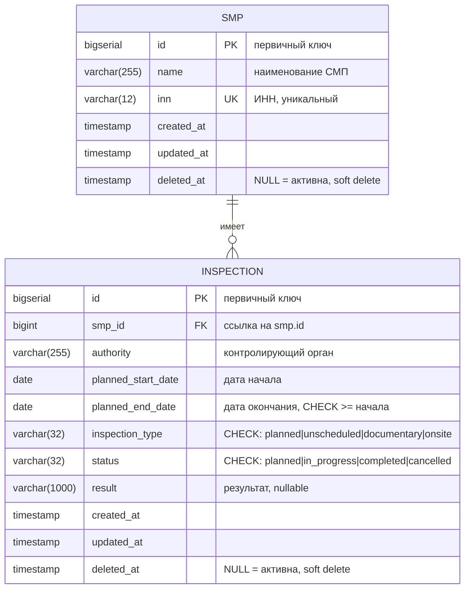

# ER-диаграмма

Схема базы данных. Две таблицы: `smp` (реестр субъектов) и `inspection` (проверки).

## Описание таблиц

### `smp` — субъект малого предпринимательства

| Поле       | Тип          | Описание                              |
| ---------- | ------------ | ------------------------------------- |
| id         | bigserial    | Первичный ключ                        |
| name       | varchar(255) | Наименование СМП                      |
| inn        | varchar(12)  | ИНН (10 или 12 цифр), уникальный      |
| created_at | timestamp    | Дата создания                         |
| updated_at | timestamp    | Дата обновления                       |
| deleted_at | timestamp    | Мягкое удаление (NULL = активна)      |

### `inspection` — проверка

| Поле                 | Тип           | Описание                                              |
| -------------------- | ------------- | ----------------------------------------------------- |
| id                   | bigserial     | Первичный ключ                                        |
| smp_id               | bigint        | Внешний ключ на `smp.id`, ON DELETE RESTRICT          |
| authority            | varchar(255)  | Контролирующий орган                                  |
| planned_start_date   | date          | Плановая дата начала                                  |
| planned_end_date     | date          | Плановая дата окончания (CHECK: ≥ даты начала)        |
| inspection_type      | varchar(32)   | Тип проверки (CHECK по 4 значениям)                   |
| status               | varchar(32)   | Статус (CHECK по 4 значениям)                         |
| result               | varchar(1000) | Результат, nullable                                   |
| created_at           | timestamp     | Дата создания                                         |
| updated_at           | timestamp     | Дата обновления                                       |
| deleted_at           | timestamp     | Мягкое удаление (NULL = активна)                      |

**Плановая длительность** (`planned_duration_days`) **не хранится** в БД. Она вычисляется в SQL-запросе:
`planned_end_date - planned_start_date + 1`. Это исключает рассинхронизацию между датами и длительностью.

## Индексы

| Таблица      | Индекс                                                             | Назначение                                |
| ------------ | ------------------------------------------------------------------ | ----------------------------------------- |
| `smp`        | UNIQUE(`inn`)                                                      | Уникальность ИНН                          |
| `smp`        | INDEX(`name`)                                                      | Поиск по наименованию                     |
| `smp`        | partial INDEX(`deleted_at`) WHERE `deleted_at IS NULL`             | Быстрая выборка активных записей          |
| `inspection` | INDEX(`smp_id`)                                                    | Join со `smp`                             |
| `inspection` | INDEX(`planned_start_date`)                                        | Фильтры и сортировка по датам             |
| `inspection` | INDEX(`status`)                                                    | Фильтр по статусу                         |
| `inspection` | INDEX(`inspection_type`)                                           | Фильтр по типу                            |
| `inspection` | partial INDEX(`deleted_at`) WHERE `deleted_at IS NULL`             | Быстрая выборка активных записей          |

**Partial index** (`WHERE deleted_at IS NULL`) — специфичная для PostgreSQL оптимизация: индекс строится только по активным записям. Так как удалённых записей со временем накапливается много, обычный индекс «разбавлялся» бы мусором. Partial-индекс остаётся компактным и быстрым.
